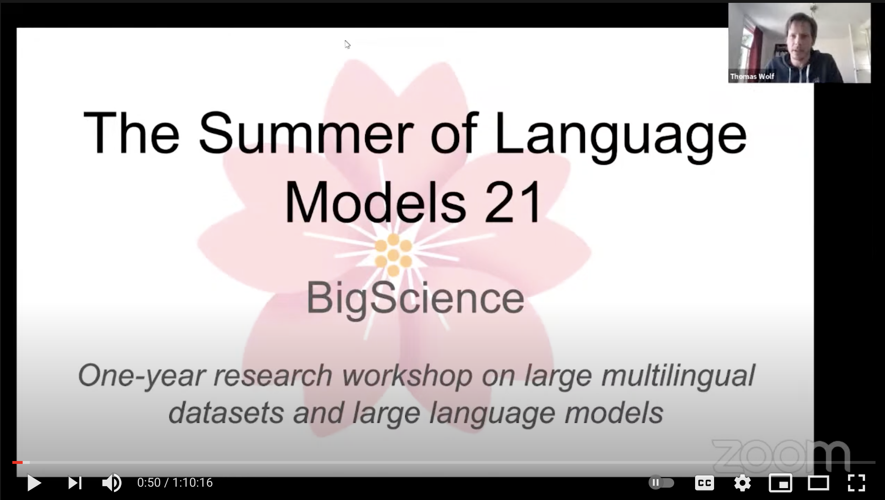

# Events

## BigScience episode #1

Our first live event is happening on July 30th, 2021 and will be co-loacted with the second ELLIS NLP workshop. You can find the program and schedule below, please note that all time slots are in CEST. If you'd like to join the talks / poster sessions please sign up [here](https://forms.gle/hVPFPBoesKgxKLV2A), Zoom and gather.town links will be sent out via email.

### Morning sessions

- 8.15 - 8.45: Intro (Thomas Wolf, Co-Founder and CSO Hugging Face, BigScience – shared talk with the first NLP workshop of ELLIS)
- 8.45 - 10.00: 3-4 short talks by BigScience working groups
- 10.00 - 10.30: Poster & breakout sessions (separate, parallel zoom rooms)
- 10:30 - 10:45: Wrapping up the posters sessions, short break
- 10:45 - 11:30: Invited talk: "Experience of an open source project maintainer for scikit-learn", Olivier Grisel (ML software engineer at Inria Saclay & maintainer for the Scikit-learn project)

### Afternoon sessions

- 15.00 - 16.00: 3-4 short talks by BigScience working groups
- 16.00 - 16.30: Poster & breakout sessions (separate, parallel zoom rooms)
- 16.30 - 17.30: gather.town (socializing)

### Invited talk

#### "Experience of an open source project maintainer for scikit-learn" by Olivier Grisel

#### Abstract

This talk will reflect on my experience as an open source project maintainer. After quickly introducing the decade-long history of the scikit-learn project, its goals and organization, I will try to identify key ingredients necessary to keep a project such as scikit-learn valuable for a wide community of users and contributors. In particular we will focus on collaboration dynamics, interactions with users, automating cross-platform packaging automated quality insurance and interactions with the wider Open Source ecosystem.

#### Speaker bio

Olivier Grisel is a Machine Learning software engineer at Inria Saclay where we works as a maintainer for the Scikit-learn project [1] and occasional contributor to related projects. Olivier is also involved in teaching Deep Learning as part of MSc Data Sciences at IP Paris [2] and Machine Learning with Scikit-learn via a MOOC [3].

- [1] https://scikit-learn.org/
- [2] https://m2dsupsdlclass.github.io/lectures-labs/
- [3] https://www.fun-mooc.fr/en/courses/machine-learning-python-scikit-learn/

- - -

## Kickoff event

The online kickoff event took place on **Wednesday, April 28th** and marked the beginning of the BigScience one-year long research workshop on very large language models. The event was recorded and is available on [YouTube](https://www.youtube.com/watch?v=TMBcm0TByF4). This is a good place to start if you'd like to know more about the project, the working groups and how to get involved.

## At a glance

*   **Officially introduced and started** the workshop and the collaboration tools
*   **Presented the first working groups** and what can be done to join and help as well as propose additional working groups
*   **Answered questions**, explained the (new) tools and how to participate

## Two sessions

The event had two identical 2h sessions in different timezones.

- Session 1: 10-12am Paris, 4-6pm Beijing, 11am-1pm Moscow, 4-6 am NYC, 1-3am SF
- Session 2: 1-3pm NYC, 10am-12pm SF, 7-9pm Paris, 8-10pm Moscow, 1-3am Beijing

## Live streams

1. Live-streams on Youtube and Tencent Meeting (same content livestreamed on all channels):
    - Youtube: http://youtube.com/channel/UCwLltQ6_P_rNgj9nYM7B4sw/live
    - Bilibili: https://space.bilibili.com/9570801/favlist?fid=1242143101
    - Tencent Meeting: [Session 1](https://meeting.tencent.com/s/jrZd4hEq5k2V) [Session 2](https://meeting.tencent.com/s/JGBUgYP1gK7K)

2. Questions on dory.app - answered on the forum
    Written anonymous questions, upvote questions to surface most relevant
    - Dory.app: https://www.dory.app/c/6a8fc0e1/9bbbbb98_bigscience-kickoff/questions#
    - Forum: https://discuss.bigscience.huggingface.co/c/bigscience-kickoff/9 
