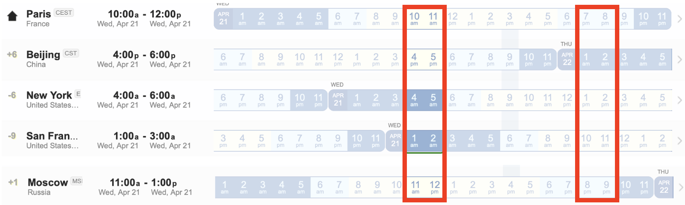

# Kickoff event - Wednesday April 28th 

On **April 28th**, a kickoff event take place online to:

*   **Officially introduce and start** the workshop and the collaboration tools
*   **Present the first working groups** and what can be done to join and help as well as  propose additional working groups
*   **Answer questions**, explain the (new) tools and how to participate

## The event has two identical 2h sessions
Join the best for your timezone

- Session 1: 10-12am Paris, 4-6pm Beijing, 11am-1pm Moscow, 4-6 am NYC, 1-3am SF
- Session 2: 1-3pm NYC, 10am-12pm SF, 7-9pm Paris, 8-10pm Moscow, 1-3am Beijing

## For each session:

1. Live-streams on Youtube and Tencent Meeting - Choose your medium (same content livestreamed on all channels - videos will be available later as well):
    - Youtube: http://youtube.com/channel/UCwLltQ6_P_rNgj9nYM7B4sw/live
    - Bilibili: https://space.bilibili.com/9570801/favlist?fid=1242143101
    - Tencent Meeting: [Session 1](https://meeting.tencent.com/s/jrZd4hEq5k2V) [Session 2](https://meeting.tencent.com/s/JGBUgYP1gK7K)

2. Ask questions on dory.app - answered on the forum
    Written anonymous questions, upvote questions to surface most relevant
    - Dory.app: https://www.dory.app/c/6a8fc0e1/9bbbbb98_bigscience-kickoff/questions#
    - Forum: https://discuss.bigscience.huggingface.co/c/bigscience-kickoff/9 
