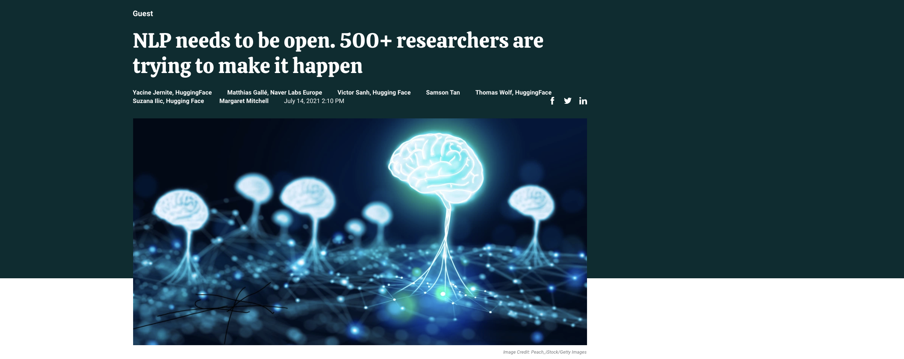
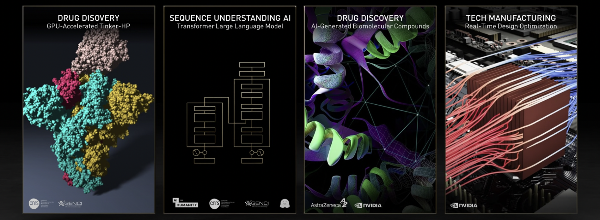
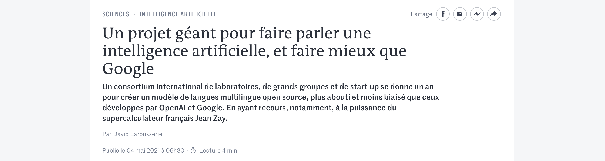

# Media

## VentureBeat (Guest article, English)

- Source: [VentureBeat](https://venturebeat.com/2021/07/14/nlp-needs-to-be-open-500-researchers-are-trying-to-make-it-happen/) – July 14, 2021

"Much like the tensions between proprietary and open-source software in the early 2000s, AI is at a turning point where it can either go in a proprietary direction, where large-scale state-of-the-art models are increasingly developed internally in companies and kept private, or in an open, collaborative, community-oriented direction, marrying the best aspects of open-source and open-science. It’s essential that we make the most of this current opportunity to push AI onto that community-oriented path so that it can benefit society as a whole."

## NVIDIA CEO Jensen Huang, Teratec Keynote

- Source: [NVIDIA](https://www.youtube.com/watch?v=kirkvFf5ytI&t=609s) – June 15, 2021

“GENCI and the Bigscience open large language model collaboration project is bringing together 500 researchers from 45 countries to develop an open source language model for industry and scientific communities.”

## MIT Tech Review (English)
- Source: [MIT Tech Review](https://www.technologyreview.com/2021/05/20/1025135/ai-large-language-models-bigscience-project/) – May 20th, 2021

"More than 500 researchers around the world are now racing to learn more about the capabilities and limitations of these models. Working together under the BigScience project led by Huggingface, a startup that takes an 'open science' approach to understanding natural-language processing (NLP), they seek to build an open-source LLM that will serve as a shared resource for the scientific community."

## Le Monde (French)
- Source: [Le Monde](https://www.lemonde.fr/sciences/article/2021/05/04/un-projet-geant-pour-faire-parler-une-intelligence-artificielle-et-faire-mieux-que-google_6079004_1650684.html) – May 4th, 2021

"La première étape a été franchie mi-avril avec l’accord du Grand équipement national de calcul intensif (Genci) et de l’Institut du développement et des ressources en informatique scientifique du CNRS (Idris), pour mettre à disposition 5 millions d’heures de calcul, ce qui représente près du quart des capacités de la machine Jean Zay, installée à Orsay."

