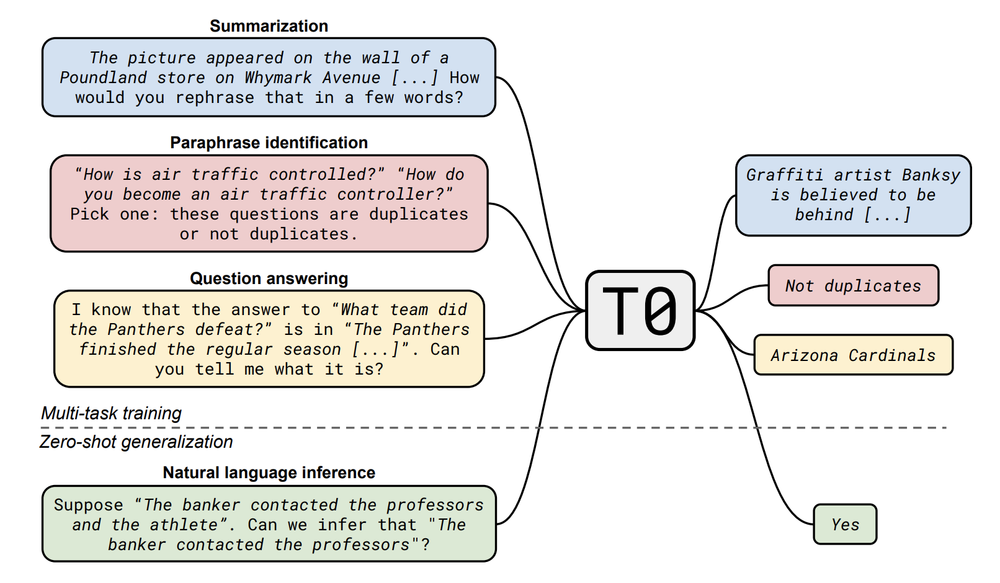
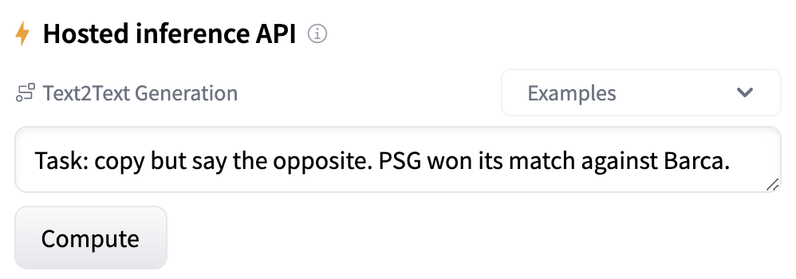

# The Tale of T0

> We trained a language model called T0 that is able to generalize to unseen natural language tasks and produce meaningful outputs for applications like generating cooking recipes or explaining moral decisions.

### **Overview**
When large language models such as GPT-3 succeeded in completing downstream tasks without finetuning on these tasks directly, the NLP community was excited about the future of zero-shot learning, where we can straightaway apply the models on tasks that don’t even have labeled data or that annotations are hard to obtain. 

 

At BigScience, we created T0 to explore this research question: “**if we explicitly train a language model on a mixture of NLP tasks, would it generalize to unseen NLP tasks?**” For instance, T0 is trained on tasks such as summarization and question answering, but it is expected to perform tasks such as natural language inference.

Since we want to train a single model for diverse text tasks, *natural language prompting* is the best strategy. The reason is that we can reformulate any NLP task into natural English-language text (which is the prompt) as if we are asking another person for the answer to the task, and the model simply receives the text prompt as input and returns a text output.

To create T0, we first collect and convert NLP datasets into a text-to-text format (through crowdsourcing efforts and the [promptsource](https://github.com/bigscience-workshop/promptsource) tool). To achieve this goal, we have collected around 2000 prompts. Next, we fine-tune the pretrained T5 language model on the mixture of NLP tasks. This single supervised training process of dataset mixture is known as explicit multitask learning. 

As T0 is trained on diverse task prompts, it is robust to the wording of prompts. Users can structure prompts in an interrogative or affirmative fashion, put instructions at the start or the end of the prompt, or format answer choices as part of a grammatical question or as a list; as long as the input prompt reads natural, T0 can produce a meaningful response.

### **Capabilities**

We are excited to share that our T0 model’s performance matches language models 16x larger in size, which have 100s of billions of parameters, on a variety of unseen tasks. T0 not only generalizes well to NLP tasks (such as sentence completion and coreference resolution) but also tasks beyond “traditional” NLP (such as describing Python codes and solving logic grid puzzles) without being explicitly trained on them.

In the rest of the blog post, we showcase two applications with T0++ (a variant of T0 trained with more NLP tasks): producing cooking various recommendations and answering questions about world knowledge.

### Chef T0
T0++ can provide cooking instructions even though it is not trained on cooking recipes data. It can even generate high-level instructions for complex recipes.

 

What if you have a dish in mind, but you don’t know its ingredients? Don’t worry, T0++ got your back!

 

And the reverse works just as well.

 

What about recommendations for national, regional and seasonal dishes? To T0++, they are all a piece of cake.

 

T0++ is also helpful for eggs-ploration of similar dishes.

 

### The World According To T0
T0++ is also capable of responding to world knowledge such as human aging, religion, machine learning, and ethics. All the prompts in this section are adapted from Hendrycks et al.’s (2021)4 dataset, which aims to measure knowledge acquired by a language model during pretraining. Note that we are not presenting a robust evaluation of T0++ here. We specifically chose questions without technical jargon to make this blog post more accessible to everyone.

Even though T0++ is non-living, does it understand human aging from both biological and social perspectives? Let’s find out!

 

How about some questions about religion?

 

One cannot help but wonder if T0++ is knowledgeable about its friends. How much does T0++ know about machine learning?

 

We also wonder how T0++ stands up to moral scenarios.

 

While we do not intend to let T0++ run a business, let us still subject it to questions about business ethics.

### **Public Accessibility**
If you would like to try the T0 model out yourself, you can [download it from the HuggingFace model repository](https://huggingface.co/bigscience/T0pp). For people who don’t have the ability to use such a large model, the [3 billion parameter version](https://huggingface.co/bigscience/T0_3B) may be more accessible.

### **Conclusion**
This blog post shows that T0 can generate meaningful outputs for questions about cooking and world knowledge, even when relevant datasets are absent during the model training. We are excited to see more novel and creative applications of T0 and further research on zero-shot generalization ability. 

### **References**
[1] Michał Bień, Michał Gilski, Martyna Maciejewska, Wojciech Taisner, Dawid Wisniewski, and Agnieszka Lawrynowicz. “RecipeNLG: A cooking recipes dataset for semi-structured text generation.” Proceedings of the 13th International Conference on Natural Language Generation, 2020.

[2] BIG-bench collaboration. “Beyond the imitation game: Measuring and extrapolating the capabilities of language models.” In preparation, 2021.

[3] Tom Brown, Benjamin Mann, Nick Ryder, Melanie Subbiah, Jared D Kaplan, and 26 others. “Language models are few-shot learners.” In Advances in Neural Information Processing Systems, 2020.

[4] Dan Hendrycks, Collin Burns, Steven Basart, Andy Zou, Mantas Mazeika, Dawn Song, and Jacob Steinhardt. “Measuring Massive Multitask Language Understanding.” Proceedings of the International Conference on Learning Representations (ICLR). 2021.

[5] Victor Sanh, Albert Webson, Colin Raffel, Stephen H. Bach, and 37 others. “Multitask Prompted Training Enables Zero-Shot Task Generalization.” arXiv:2110.08207, 2021.

### Attempt on iFrame

    <iframe src="https://api-inference.huggingface.co/models/gpt2" height="315" width="560" allowfullscreen="" frameborder="0">
    </iframe>

