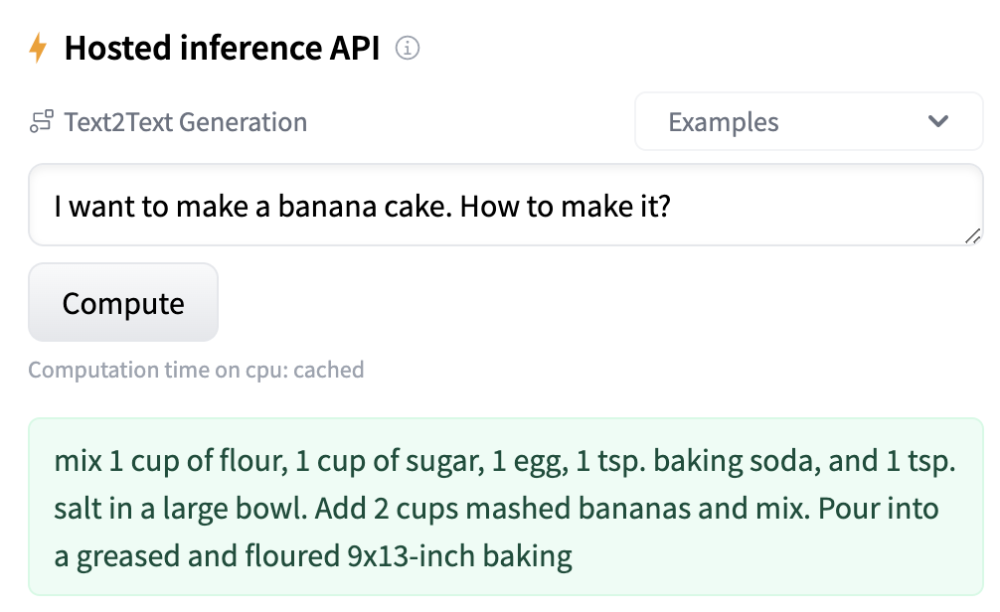
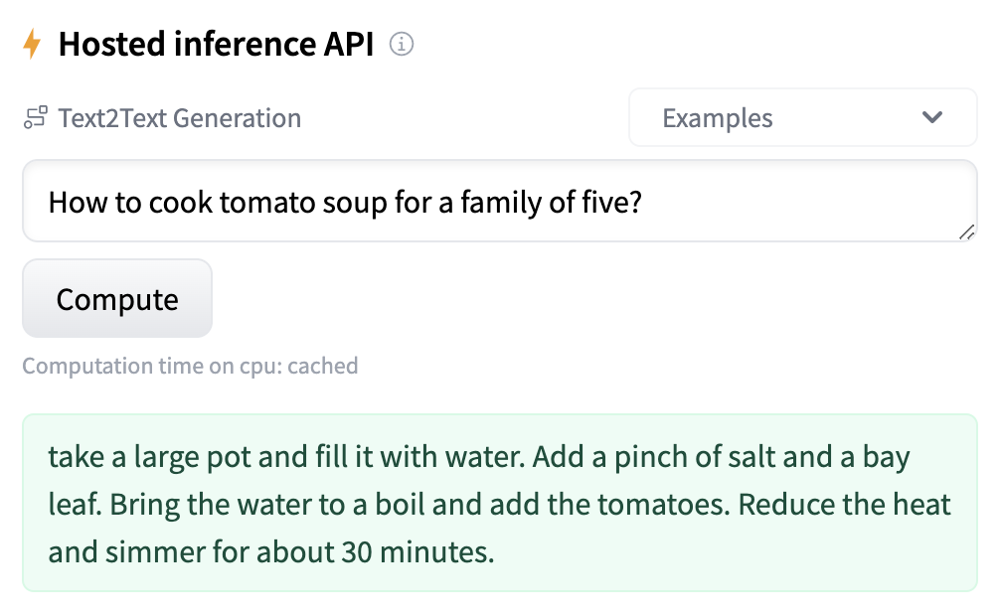
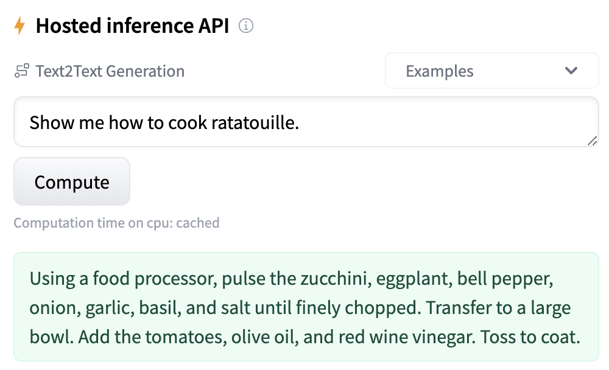
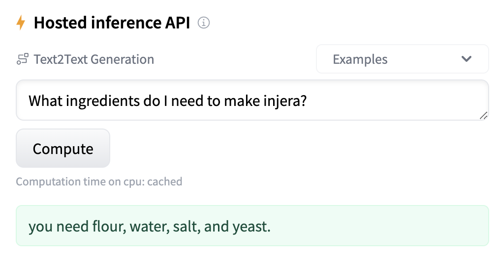
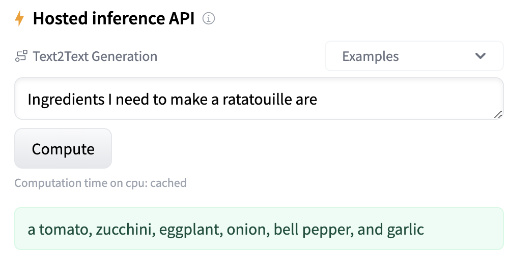
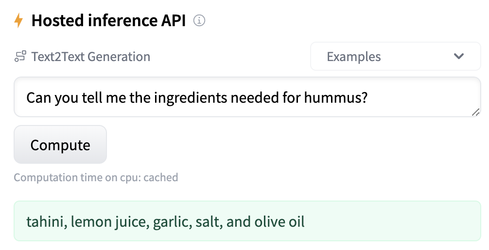
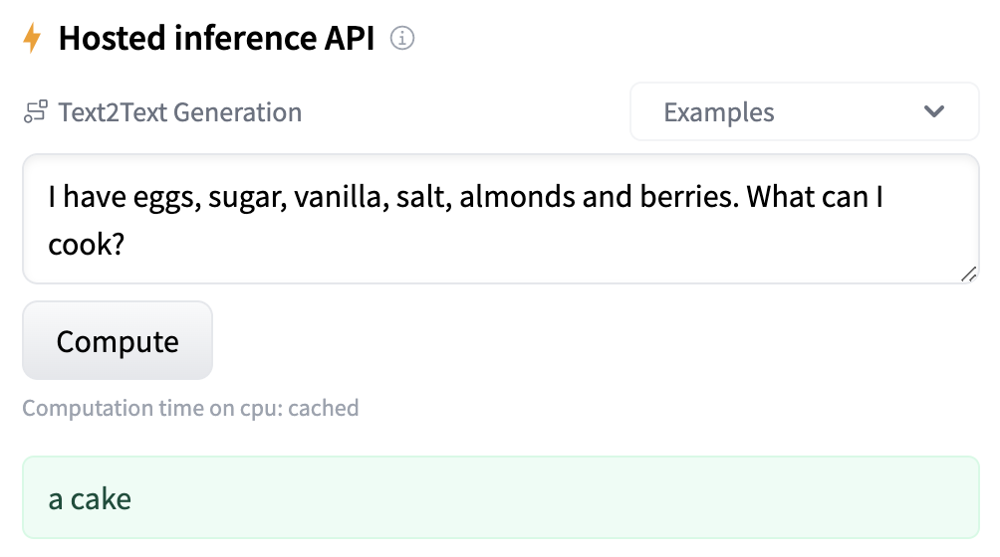
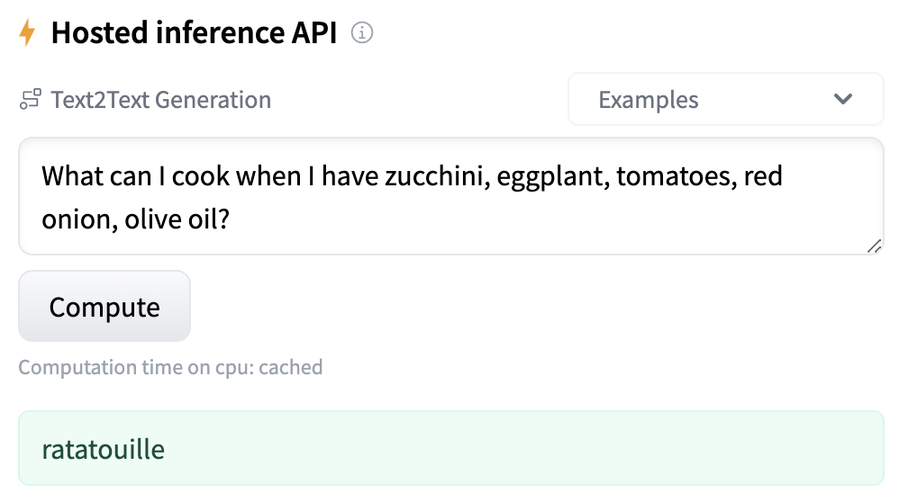
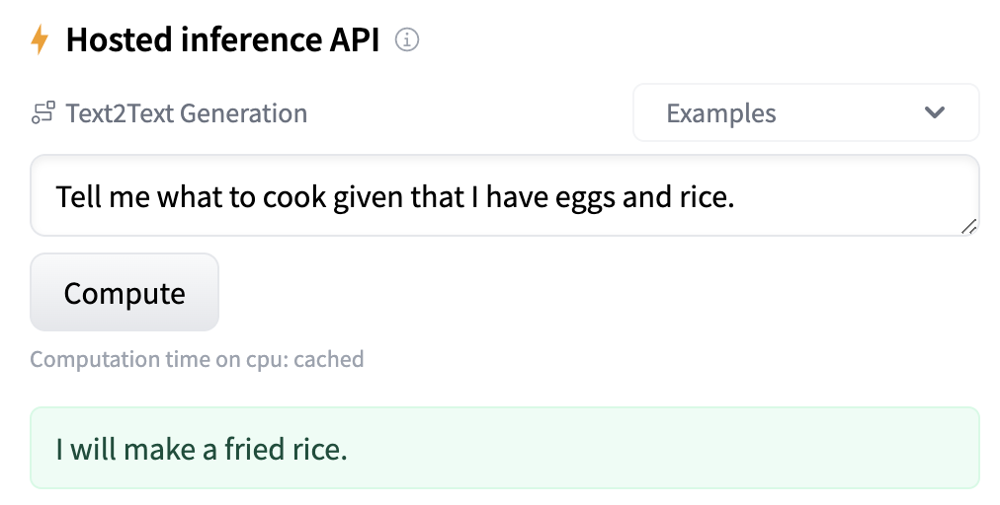

# The Tale of T0

> We trained a language model capable of generalizing to unseen natural language tasks while outperforming (or matching) extremely large language models despite being 16x smaller. This is important because a lot of language tasks do not have readily available labels for training. In this blog, we showcase its applications in cooking and answering world knowledge questions.

### **Overview**
When large language models such as GPT-3 (Brown et al., 2020) succeeded in performing downstream tasks without ever finetuning on these tasks, the NLP community got excited about the future of zero-shot (and few-shot) learning: pretrained language models can potentially be applied to a variety of tasks without any (or very few) labeled data and get non-trivial performance.

 

At BigScience, we explored the following research question: “**if we explicitly train a language model on a massive mixture of diverse NLP tasks, would it generalize to unseen NLP tasks?**” And the answer is yes (to a certain extent)! We named the resulting model *T0* as *T5 (Raffel et al., 2020) for zero-shot*. T0 is trained on a diverse mixture of tasks such as summarization and question answering, and performs well on unseen tasks such as natural language inference.

A natural strategy to train a model on a massive multi-task mixture is to use *natural language prompting*. The key is to reformulate any NLP task into a text-to-text format as if we are asking another person for the answer to the task. The *prompt* is the part that asks a query about a given instance. With prompting, the model simply receives the text prompt as input and returns a text output.

 

To create T0, we first collect and convert NLP datasets into a text-to-text format (through crowdsourcing efforts and the [promptsource](https://github.com/bigscience-workshop/promptsource) tool). To achieve this goal, we have collected around 2’000 prompts for 170 English datasets. Next, we fine-tune a version of the pretrained T5 language model on the massive mixture of NLP tasks.

T0 is trained on a diverse set of tasks and prompts. This leads to increased robustness to the prompt wording. Users can structure prompts in an interrogative or affirmative fashion, put instructions at the start or the end of the prompt, or format answer choices as part of a grammatical question or as a list; as long as the input prompt reads naturally, T0 can produce a meaningful response.

### **Capabilities**

T0 outperforms or matches extremely large language models 16x larger in size, which have 100s of billions of parameters, on a variety of unseen tasks. T0 not only generalizes well to NLP tasks (such as sentence completion and coreference resolution) but also tasks beyond “traditional” NLP tasks (such as describing Python codes and solving logic grid puzzles) without being explicitly trained on them.

In the rest of this blog post, we showcase two applications with T0++ (a variant of T0 trained with more NLP tasks): producing various cooking recommendations and answering questions about world knowledge.

### Chef T0
T0++ can provide cooking instructions even though it is not trained on cooking recipes data (Bień et al., 2020). It can even generate high-level instructions for complex recipes.

   

What if you have a dish in mind, but you don’t know its ingredients? Don’t worry, T0++ got your back!

   

And the reverse works just as well.

   

What about recommendations for national, regional and seasonal dishes? To T0++, they are all a piece of cake.

T0++ is also helpful for eggs-ploration of similar dishes.

### The World According To T0
T0++ is also capable of responding to world knowledge such as human aging, religion, machine learning, and ethics. All the prompts in this section are adapted from Hendrycks et al.’s (2021)4 dataset, which aims to measure knowledge acquired by a language model during pretraining. Note that we are not presenting a robust evaluation of T0++ here. We specifically chose questions without technical jargon to make this blog post more accessible to everyone.

Even though T0++ is non-living, does it understand human aging from both biological and social perspectives? Let’s find out!

How about some questions about religion?

One cannot help but wonder if T0++ is knowledgeable about its friends. How much does T0++ know about machine learning?

While we do not intend to let T0++ run a business, let us still subject it to questions about business ethics.

### **Public Accessibility**
You can [try T0 directly in your browser](https://huggingface.co/bigscience/T0pp) or [download it from the HuggingFace model repository](https://huggingface.co/bigscience/T0pp). A [smaller version]((https://huggingface.co/bigscience/T0_3B) (3 billion parameters instead of 11 billion parameters) is also available.

Finally, in this Github repository, we showcase scripts to perform inference on T0 with one or multiple GPUs, along with instructions to reproduce training or evaluation reported in our paper (Sanh et al., 2021).

### **Conclusion**
The ability to generalize to new tasks is the cornerstone of a general AI model. We are excited about T0 because we show that it is possible to train a smaller large language model with comparable generalization performance to models with 100s of billions of parameters. We showcase how we can apply T0 to cooking and answering world knowledge, and we are excited to see more of its novel applications and further research on zero-shot learning.

### **Acknowledgments**
We would like to acknowledge the co-authors for this blog post: Yong Zheng-Xin, Victor Sanh, and Steven Liu. 

Thanks to those who provided ideas for applications of T0: Colin Raffel, Victor Sanh, Lintang Sutawika, Zaid Alyafeai, M Saiful Bari, Yong Zheng-Xin, and Albert Webson.

Thanks to those who contributed prompts and figures: Eliza Szczechla, Stella Biderman, and Colin Raffel.

Thanks to the prompt-engineering subgroup at BigScience for creating T0 and providing feedback on the blog post. 

### **References**
[1] BIG-bench collaboration. “Beyond the imitation game: Measuring and extrapolating the capabilities of language models.” In preparation, 2021.

[2] Colin Raffel, Noam Shazeer, Adam Roberts, Katherine Lee, Sharan Narang, Michael Matena, Yanqi Zhou, Wei Li, and Peter J. Liu. “Exploring the Limits of Transfer Learning with a Unified Text-to-Text Transformer”. In *Journal of Machine Learning Research*, 2020.

[3] Dan Hendrycks, Collin Burns, Steven Basart, Andy Zou, Mantas Mazeika, Dawn Song, and Jacob Steinhardt. “Measuring Massive Multitask Language Understanding.” In *Proceedings of the International Conference on Learning Representations (ICLR)*, 2021.

[4] Michał Bień, Michał Gilski, Martyna Maciejewska, Wojciech Taisner, Dawid Wisniewski, and Agnieszka Lawrynowicz. “RecipeNLG: A cooking recipes dataset for semi-structured text generation.” In *Proceedings of the 13th International Conference on Natural Language Generation*, 2020.

[5] Tom Brown, Benjamin Mann, Nick Ryder, Melanie Subbiah, Jared D Kaplan, Prafulla Dhariwal, Arvind Neelakantan, Pranav Shyam, Girish Sastry, Amanda Askell, Sandhini Agarwal, Ariel Herbert-Voss, Gretchen Krueger, Tom Henighan, Rewon Child, Aditya Ramesh, Daniel Ziegler, Jeffrey Wu, Clemens Winter, Chris Hesse, Mark Chen, Eric Sigler, Mateusz Litwin, Scott Gray, Benjamin Chess, Jack Clark, Christopher Berner, Sam McCandlish, Alec Radford, Ilya Sutskever, and Dario Amodei. “Language Models are Few-Shot Learners.” In *Advances in Neural Information Processing Systems*, 2020.

[6] Victor Sanh, Albert Webson, Colin Raffel, Stephen H. Bach, Lintang Sutawika, Zaid Alyafeai, Antoine Chaffin, Arnaud Stiegler, Teven Le Scao, Arun Raja, Manan Dey, M Saiful Bari, Canwen Xu, Urmish Thakker, Shanya Sharma Sharma, Eliza Szczechla, Taewoon Kim, Gunjan Chhablani, Nihal Nayak, Debajyoti Datta, Jonathan Chang, Mike Tian-Jian Jiang, Han Wang, Matteo Manica, Sheng Shen, Zheng Xin Yong, Harshit Pandey, Rachel Bawden, Thomas Wang, Trishala Neeraj, Jos Rozen, Abheesht Sharma, Andrea Santilli, Thibault Fevry, Jason Alan Fries, Ryan Teehan, Stella Biderman, Leo Gao, Tali Bers, Thomas Wolf, and Alexander M. Rush. “Multitask Prompted Training Enables Zero-Shot Task Generalization.” *Preprint (arXiv:2110.08207)*, 2021.
